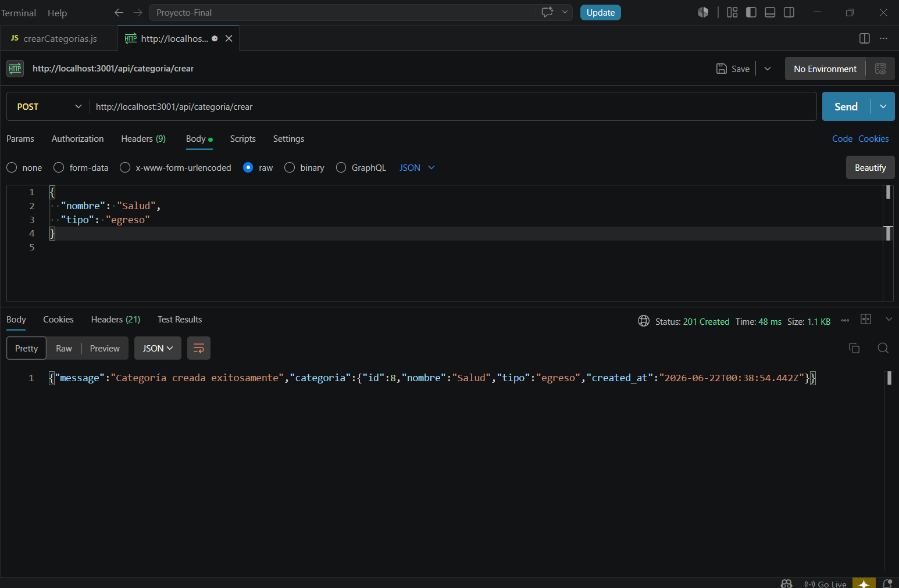
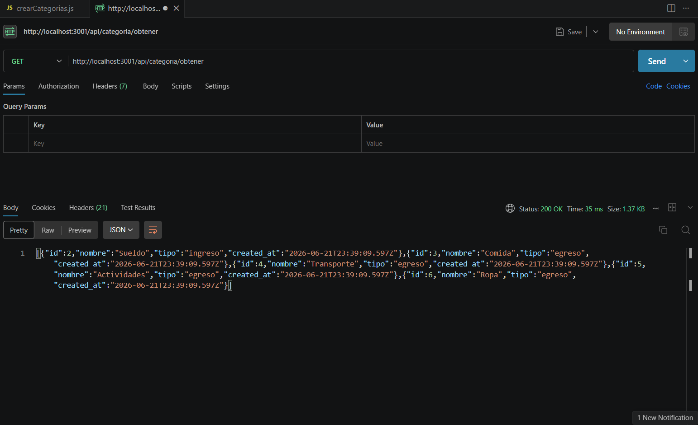
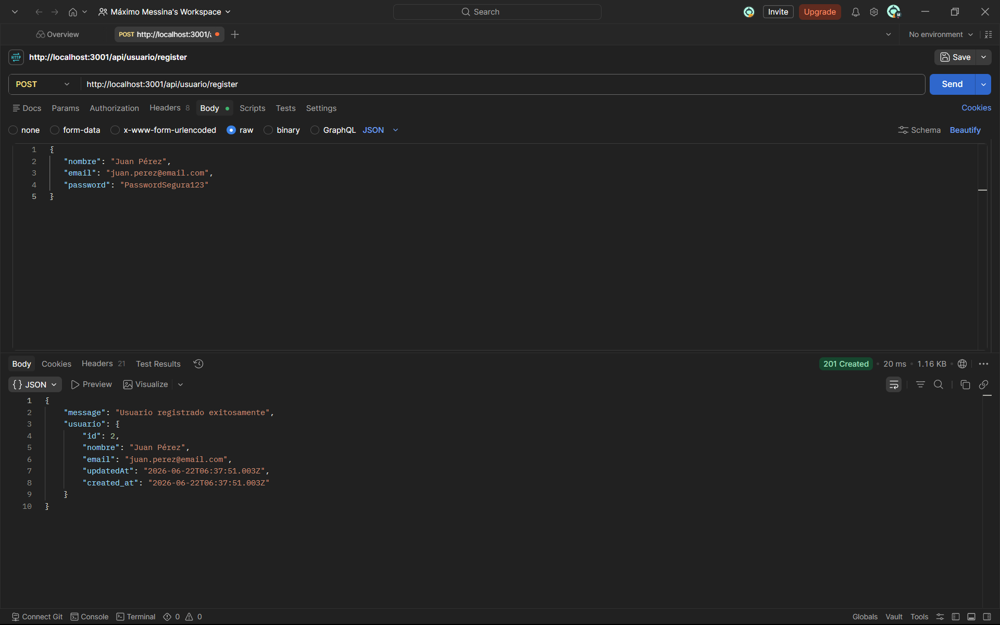
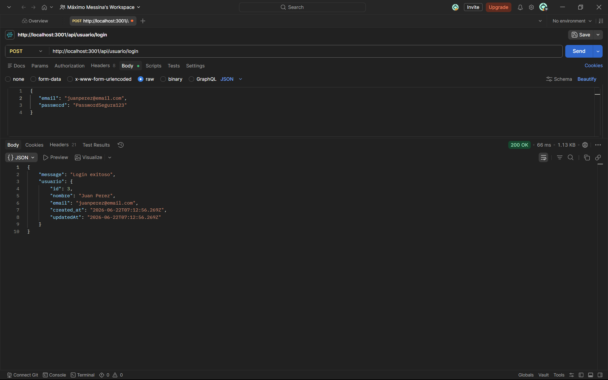
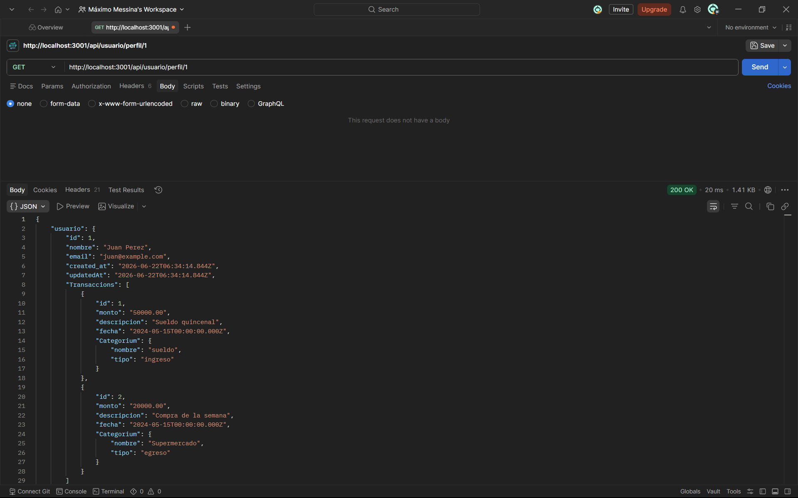
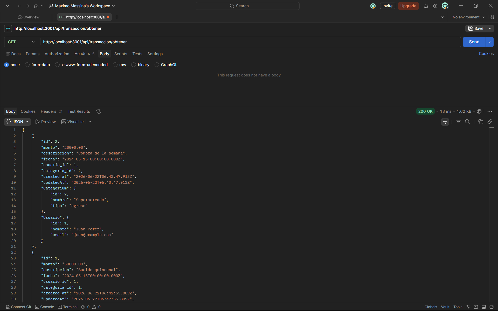
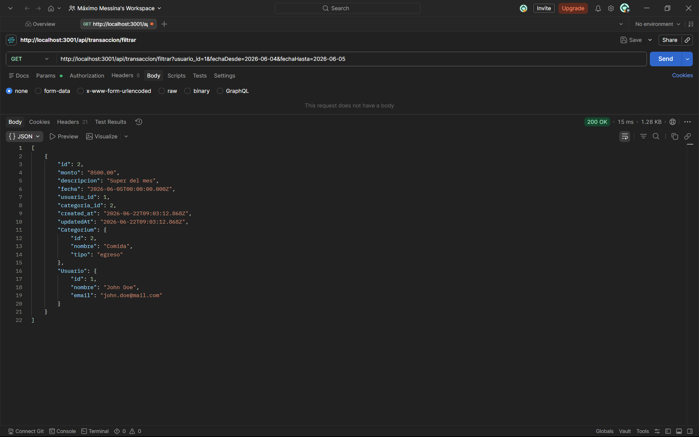
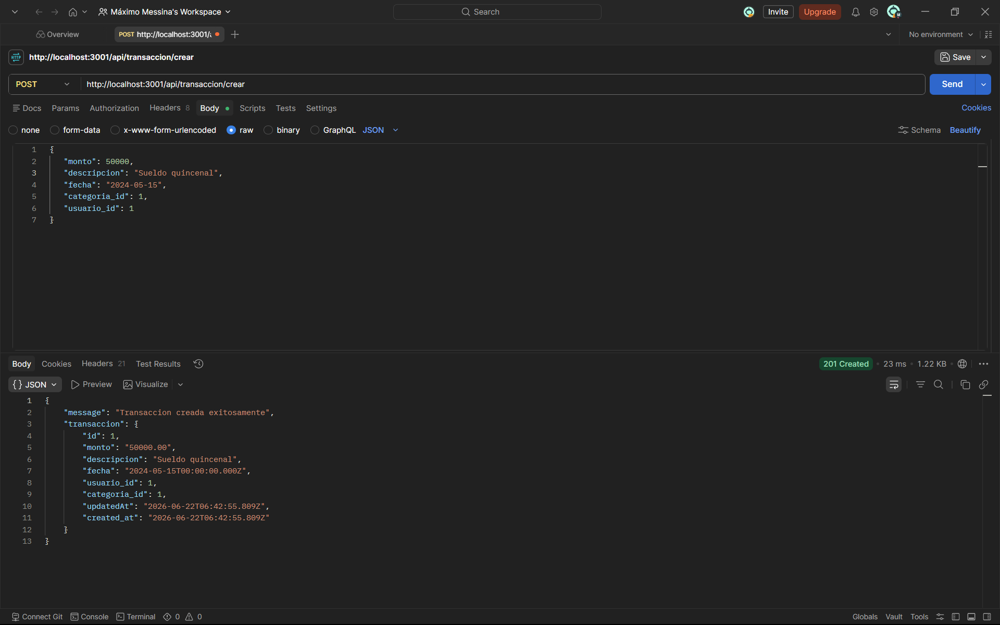
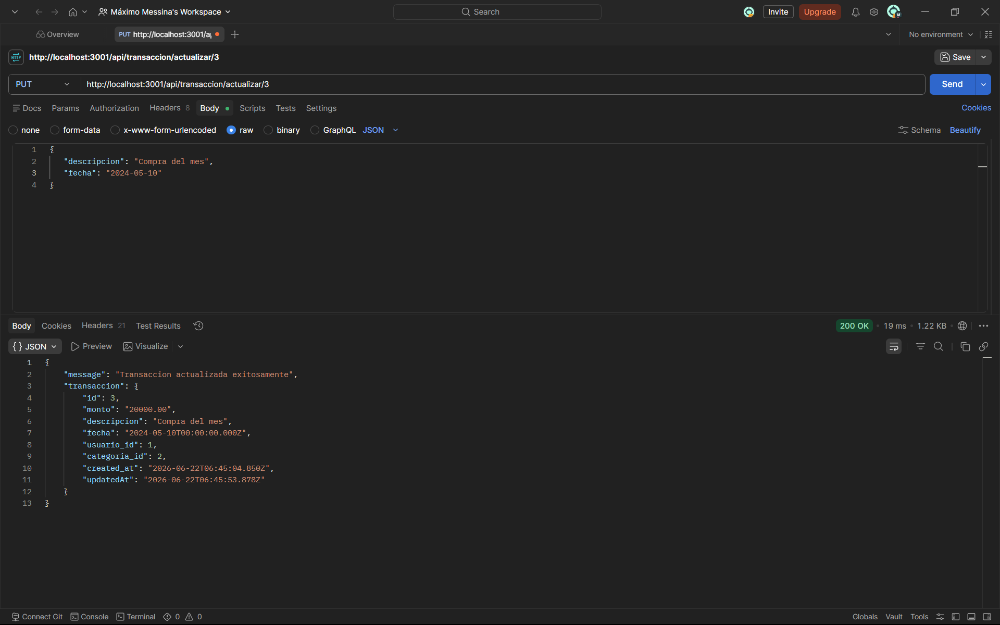
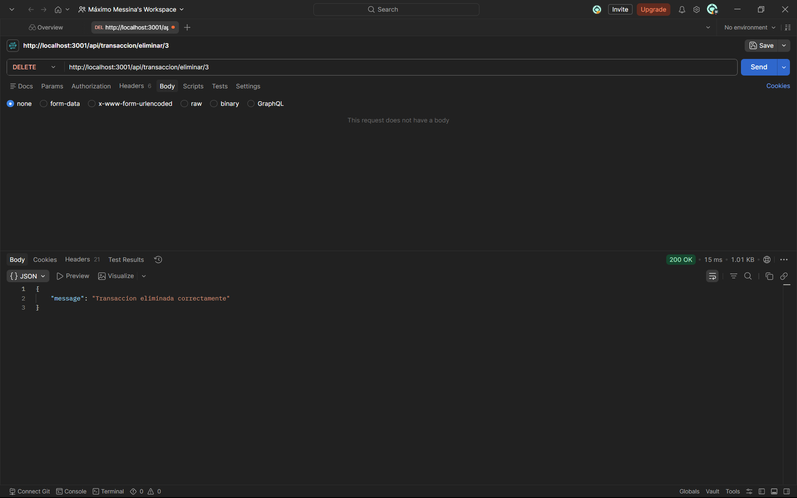

# Sistema de Control de Gastos Personales

## Descripción del Proyecto

Esta aplicación es una plataforma para registrar, categorizar y analizar ingresos y gastos personales. Actualmente, el proyecto corresponde a la entrega del **Parcial 2** de **Programacion III** , enfocado en el desarrollo de un Backend bajo la arquitectura **MVC** utilizando Node.js, Express y **Sequelize** (PostgreSQL) para la persistencia de datos reales, todo orquestado con Docker Compose.

**Futura Update (Proyecto Final):** Esta API está preparada e intencionalmente desacoplada para ser consumida en la próxima etapa por un Frontend desarrollado en **React** e implementar **JWT**.

---

## Grupo N°16 - Integrantes

* **Priscila Arrimada:** POST y GET de categoria + seeders.
* **Tomás Astudillo:** POST transaccion y relaciones entre tablas.
* **Valentina Guerrieri:** GET transaccion con filtros.
* **Máximo Messina:** POST, GET usuario y GET usuario por ID + migraciones.
* **Máximo Moraes:** GET transaccion por ID, PUT y DELETE.
* **Lucas Rojas:** GET de calculo de transacciones (balance).

---

## Tecnologias aplicadas

* **Backend:** Node.js, Express, TypeScript / JavaScript.
* **Base de Datos:** PostgreSQL.
* **ORM:** Sequelize.
* **Infraestructura:** Docker & Docker Compose (Base de datos, Caddy, pgAdmin).
* **Control de Versiones:** Git & GitHub.

## Metodología de Trabajo con Git y GitHub

El equipo implementó un flujo de trabajo estructurado basado en ramas:

1. **Ramas Principales**

- **`main`:** Rama exclusiva para versiones estables y aptas para entrega final
- **`dev`:** Rama de integración central para pruebas previas al redespliegue

2. **Ramas Personales**
   Cada integrante desarrolló sus asignaciones en una rama personal aislada, utilizando nomenclatura estándar: `alumno-apellido`.

3. **Flujo de Integración**
   Todo código nuevo o modificado requirió de la generación de _commits_ atómicos y descriptivos. Para unificar los cambios, cada desarrollador abrió un **Pull Request** hacia las ramas de integración (`dev`/`main`), permitiendo la revisión del código por parte del equipo y garantizando una resolución prolija de conflictos antes de ejecutar la mezcla definitiva (_merge_).

## Arquitectura General

[Ver Modelo Relacional.](./modelo_relacional.md)

```
┌─────────────┐    ┌─────────────┐    ┌─────────────┐
│   Caddy     │    │   React     │    │   Express   │
│  (Proxy)    │◄──►│ (Frontend)  │◄──►│  (Backend)  │
│   :80       │    │   :3000     │    │   :3001     │
└─────────────┘    └─────────────┘    └─────────────┘
                                              │
                   ┌─────────────┐    ┌─────────────┐
                   │    Redis    │    │ PostgreSQL  │
                   │  (Cache)    │    │    (DB)     │
                   │   :6379     │    │   :5432     │
                   └─────────────┘    └─────────────┘
```

Todos los servicios corren dentro de contenedores Docker y se comunican a traves de una red interna. Caddy actua como reverse proxy: recibe todo el trafico en el puerto 80 y lo redirige al frontend o al backend segun la URL.

Servicio     | Tecnologia          | Puerto | Funcion
-------------|---------------------|--------|---------
**Frontend** | React 18            | 3000   | Interfaz de usuario
**Backend**  | Express + Sequelize | 3001   | API REST
**Database** | PostgreSQL 15       | 5432   | Base de datos relacional
**Cache**    | Redis 7             | 6379   | Cache y sesiones
**Proxy**    | Caddy 2             | 80     | Reverse proxy
**pgAdmin**  | pgAdmin 4           | 5050   | Administracion visual de la BD

[Para iniciar el proyecto, podes seguir esta guia.](./iniciar_proyecto.md)

---

## Estructura del Proyecto

```text
📦 Proyecto-Final
 ┣ 📂 backend/                 # Lógica del Servidor y API REST
 ┃ ┣ 📂 config/                # Configuraciones (Ej: Conexión de Sequelize a la BD)
 ┃ ┣ 📂 controllers/           # Controladores (Lógica de negocio: Usuarios, Categorías, Transacciones)
 ┃ ┣ 📂 middleware/            # Interceptores (Ej: Autenticación, Validaciones)
 ┃ ┣ 📂 migrations/            # Migraciones de base de datos
 ┃ ┣ 📂 models/                # Modelos de Sequelize (Definición de tablas e index de relaciones)
 ┃ ┣ 📂 routes/                # Rutas de la API (Endpoints GET, POST, PUT, DELETE)
 ┃ ┣ 📂 seeders/               # Datos de prueba
 ┃ ┣ Dockerfile                # Imagen docker
 ┃ ┣ package.json              # Dependencias del Backend
 ┃ ┣ server.js                 # Clase principal del servidor Express
 ┃ ┗ tsconfig.json             # Config de ts
 ┣ 📂 caddy/                   # Configuración del proxy reverso (Caddyfile)
 ┣ 📂 database/                # Scripts SQL de inicialización (init.sql)
 ┣ 📂 frontend/                # (En desarrollo para el Proyecto Final) Aplicación React
 ┣ 📂 img/                     # Imagenes para documentacion
 ┣ 📂 pgadmin/                 # Configuración de interfaz gráfica para la BD
 ┣ docker-compose.yml          # Orquestador de contenedores (App, DB, pgAdmin, Caddy)
 ┣ iniciar_proyecto.md         # Guia para iniciar proyecto
 ┣ modelo_relacional.md        # Modelo relacional del proyecto
 ┗ README.md                   # Documentación del proyecto
 ```

---

## Endpoints Implementados

### Endpoints de Categorias:

#### Crear categoría

Permite crear una nueva categoría.

```http
POST /api/categoria/crear
```

**Ejemplo:**
```json
{
  "nombre": "Salud",
  "tipo": "egreso"
}
```
Antes de crearla se verifica que no exista otra categoría con el mismo nombre.



### Obtener categorías

```http
GET /api/categoria/obtener
```
Devuelve todas las categorías guardadas en la base de datos.



### Endpoints de Usuarios:

#### POST Registrar Usuario

Da de alta a un usuario en la plataforma. El modelo ejecuta validaciones nativas de Sequelize en segundo plano para asegurar que el email tenga un formato legítimo (`isEmail`) y que no se encuentre duplicado en PostgreSQL (`unique: true`).

```http
POST api/usuario/register
```

**Ejemplo:**

```json
{
   "nombre": "Juan Pérez",
   "email": "juan.perez@email.com",
   "password": "PasswordSegura123"
}
```
**Respuesta Exitosa (201 Created):**

```json
{
   "id": 1,
   "nombre": "Juan Pérez",
   "email": "juan.perez@email.com",
   "createdAt": "2026-06-21T21:40:00.000Z"
}
```



#### POST Login Usuario

Autentica las credenciales de un usuario. Compara de forma segura el hash de la contraseña almacenada en la base de datos contra el string ingresado por el cliente.

```http
POST api/usuario/login
```

**Cuerpo de la Petición (JSON Body):**

```json
{
   "email": "juan.perez@email.com",
   "password": "PasswordSegura123"
}
```

**Respuesta Exitosa (200 OK):**

```json
{
   "message": "Inicio de sesión exitoso",
   "usuario": {
      "id": 1,
      "nombre": "Juan Pérez",
      "email": "juan.perez@email.com"
   }
}
```



#### GET Perfil por ID

Retorna el perfil completo de un usuario específico a partir de su id en la ruta. Utiliza `findByPk()` con un `include` anidado en dos niveles: incorpora las transacciones del usuario y, dentro de cada una, el detalle de la categoría correspondiente.

```http
GET api/usuario/perfil/:id
```

**Respuesta Exitosa (200 OK):**

```json
{
  "usuario": {
    "id": 1,
    "nombre": "Juan Pérez",
    "email": "juan.perez@email.com",
    "Transaccions": [
      {
        "id": 3,
        "monto": "5000.00",
        "descripcion": "Sueldo mensual",
        "fecha": "2026-06-01T00:00:00.000Z",
        "Categorium": {
          "nombre": "Trabajo",
          "tipo": "ingreso"
        }
      }
    ]
  }
}
```



### Endpoints de Transacciones:

#### GET /transaccion/obtener

Devuelve el historial completo de todas las transacciones registradas en la base de datos. Realiza un JOIN con los modelos `Categoria` y `Usuario` para exponer datos legibles en lugar de solo claves foráneas. Los resultados se ordenan de forma descendente por fecha de transacción.

```http
GET /api/transaccion/obtener
```

**Respuesta Exitosa (200 OK):**

```json
[
  {
    "id": 3,
    "monto": "5000.00",
    "descripcion": "Sueldo mensual",
    "fecha": "2026-06-01T00:00:00.000Z",
    "Categorium": {
      "id": 2,
      "nombre": "Trabajo",
      "tipo": "ingreso"
    },
    "Usuario": {
      "id": 1,
      "nombre": "Juan Pérez",
      "email": "juan.perez@email.com"
    }
  }
]
```



#### GET /transaccion/filtrar

Permite consultar transacciones aplicando filtros por usuario, categoria o rango de fechas. Utiliza parametros de consulta (req.query) y operadores de Sequelize para construir la busqueda. Devuelve las transacciones encontradas junto con los datos relacionados de Usuario y Categoria.

```http
GET /api/transaccion/filtrar?usuario_id=1&fechaDesde=2026-01-01&fechaHasta=2026-06-30
```

Los parámetros de consulta disponibles son:

Parámetro      | Tipo   | Descripción
---------------|--------|-------------
`usuario_id`   | number | Filtra transacciones pertenecientes a un usuario específico
`categoria_id` | number | Filtra transacciones de una categoría determinada
`fechaDesde`   | date   | Fecha de inicio del rango (formato ISO 8601)
`fechaHasta`   | date   | Fecha de fin del rango (formato ISO 8601)

Todos los parámetros son opcionales y combinables entre sí.



#### POST /transaccion/crear

Crea una nueva transacción en el sistema. Recibe por el cuerpo de la petición el monto, descripción, fecha, `usuario_id` y `categoria_id`.

```http
POST /api/transaccion/crear
```

**Cuerpo de la Petición (JSON Body):**

```json
{
  "monto": 5000.00,
  "descripcion": "Sueldo mensual",
  "fecha": "2026-06-01",
  "usuario_id": 1,
  "categoria_id": 2
}
```

**Respuesta Exitosa (201 Created):**

```json
{
  "message": "Transaccion creada exitosamente",
  "transaccion": {
    "id": 5,
    "monto": "5000.00",
    "descripcion": "Sueldo mensual",
    "fecha": "2026-06-01T00:00:00.000Z",
    "usuario_id": 1,
    "categoria_id": 2
  }
}
```



#### PUT /transaccion/actualizar/:id

Modifica una transacción existente identificada por su `:id` en la ruta. Acepta los campos `monto`, `descripcion`, `fecha` y `categoria_id` en el cuerpo de la petición, actualizando únicamente los que sean enviados.

```http
PUT /api/transaccion/actualizar/:id
```

**Cuerpo de la Petición (JSON Body):**

```json
{
  "monto": 4500.00,
  "descripcion": "Sueldo mensual corregido"
}
```

**Respuesta Exitosa (200 OK):**

```json
{
  "message": "Transaccion actualizada exitosamente",
  "transaccion": {
    "id": 5,
    "monto": "4500.00",
    "descripcion": "Sueldo mensual corregido",
    "fecha": "2026-06-01T00:00:00.000Z",
    "usuario_id": 1,
    "categoria_id": 2
  }
}
```




#### DELETE /transaccion/:id

Elimina de forma permanente una transacción identificada por su `:id` en la ruta. Verifica la existencia del registro antes de proceder.

```http
DELETE /api/transaccion/eliminar/:id
```

**Respuesta Exitosa (200 OK):**

```json
{
  "message": "Transaccion eliminada correctamente"
}
```



---

## Explicación de Funciones

### Usuario (usuarioController):

* **`register`:** Método asíncrono encargado de procesar la creación de nuevas cuentas en el sistema. Captura las propiedades `nombre`, `email` y `password` desde el cuerpo de la petición (`req.body`). Aplica un enfoque defensivo ejecutando primero el método `findOne()` de Sequelize para verificar de forma temprana si el correo ya existe en el sistema. Si hay colisión de datos, detiene el flujo devolviendo un estado HTTP `400 Bad Request` indicando el conflicto. En caso contrario, invoca la función asíncrona `create()` para persistir el registro de forma permanente en PostgreSQL y retorna un estado `201 Created`.

* **`login`:** Controlador diseñado para validar el acceso de los usuarios a la API. Utiliza el método `findOne({ where: { email } })` para localizar al usuario correspondiente. Si la búsqueda arroja un resultado nulo, o si al llamar al método de validación de contraseñas de la instancia (`validarPassword()`) se detecta una discrepancia en las credenciales criptográficas, el controlador interrumpe el ciclo devolviendo inmediatamente un estado HTTP `401 Unauthorized` por motivos de seguridad. Si los datos son correctos, expide una respuesta con estado `200 OK` adjuntando los datos esenciales del usuario para el manejo del estado en la aplicación.

* **`perfil`:** Controlador encargado de exponer el perfil detallado de un usuario específico. Obtiene el identificador desde los parámetros de ruta (`req.params.id`) y ejecuta `findByPk()` con un `include` anidado en dos niveles: primero trae todas las `Transacciones` asociadas al usuario (filtrando los atributos de id, monto, descripción y fecha) y, dentro de cada una, incorpora la `Categoria` correspondiente (nombre y tipo). Si no existe ningún usuario con ese identificador, interrumpe el flujo devolviendo un estado HTTP `404 Not Found`. En caso contrario, responde con estado `200 OK` adjuntando el objeto completo del usuario junto a su historial de transacciones enriquecido con los datos de categoría.

### Categoria (categoriaController):

`crearCategoria`: Permite crear nuevas categorías. Recibe `nombre` y `tipo` desde `req.body`, valida que no exista una categoría con el mismo nombre y, si todo es correcto, la guarda en la base de datos utilizando `create()`, devolviendo la categoría creada con estado 201 o un error 500 en caso de fallo.

### Transacciones (transacionController):

* **`crearTransaccion`:** Intercepta peticiones POST para registrar nuevas operaciones. Extrae el monto, descripción, fecha, usuario_id y categoria_id enviados en el cuerpo de la petición (req.body). Utiliza el método create() del ORM Sequelize para guardar el nuevo registro en la base de datos PostgreSQL. Si la operación es exitosa, devuelve un estado 201 (Created) junto con un mensaje de éxito y el objeto de la transacción. Todo el bloque está protegido por un try/catch que devuelve un error 500 si falla la inserción.

* **`obtenerTransacciones`:** Función asíncrona encargada de leer el historial completo mediante una petición GET. Utiliza el método findAll() del modelo Transaccion. Para evitar devolver solo identificadores numéricos, implementa la propiedad include para hacer un cruce relacional (JOIN) con los modelos Categoria y Usuario, extrayendo atributos legibles y específicos como el nombre, email y tipo. Además, ordena los resultados de forma descendente (los más recientes primero) basándose en la fecha asignada y la fecha de creación del registro. Responde con los datos en formato JSON o un error 500 en caso de fallo.

* **`actualizarTransaccion`:** Permite la edición de un registro existente mediante el método PUT. Primero, extrae el identificador dinámico de la ruta a través de req.params.id y busca la coincidencia en la base de datos usando findByPk(). Si el ID no existe, frena la ejecución y devuelve de forma temprana un error 404 (No encontrada). Si lo encuentra, evalúa uno a uno qué campos fueron enviados en el cuerpo de la petición (evaluando si son diferentes de undefined) para reemplazar únicamente los datos modificados y conservar el resto intacto. Finalmente, ejecuta el método update() de Sequelize y devuelve la transacción actualizada.

* **`eliminarTransaccion`:** Endpoint destructivo accesible por DELETE para borrar transacciones específicas. Captura el ID desde la ruta y localiza el registro con findByPk(). Si la transacción no existe, retorna un error 404 como medida defensiva. Si es hallada con éxito, ejecuta el método destroy() proporcionado por el ORM para borrar permanentemente la fila correspondiente en la tabla de la base de datos. Culmina la petición retornando un mensaje JSON de confirmación exitosa.

* **`obtenerTransaccionesFiltradas`:** Esta funcion sirve para no tener que traer todas las transacciones siempre que quieras consultar bajo algun criterio mas especifico. Se le pueden pasar filtros como por ejemplo, una categoria, un rango de fechas y te devuelve solo esas transacciones. Esta funcion se utiliza mediante parametros de consulta (`req.query`).
Primero extrae los parametros recibidos desde la URL y construye un objeto `where` que utiliza Sequelize para generar la consulta correspondiente. Para el filtrado por fechas utiliza el operador `Op.between`, que permite recuperar las transacciones comprendidas entre dos fechas determinadas.
La consulta se realiza mediante `findAll()`, incorporando informacion relacionada de los modelos `Categoria` y `Usuario` mediante la propiedad `include`, evitando devolver solo identificadores numericos. Los resultados se ordenan por fecha de forma descendente y se envian al cliente en formato JSON.
Toda la operacion se encuentra protegida por un `try/catch`, devolviendo un error 500 en caso de producirse algun fallo durante la consulta, como en el resto de funciones.

#### Balance de Transacciones:

El cálculo del balance se divide en tres etapas funcionales:

1. **`Transaccion.findAll` (Consulta y Agregación):** Se encarga de la comunicación con PostgreSQL. Filtra los registros por el `usuario_id` y delega la operación matemática al motor de la base de datos usando `fn('SUM', col('monto'))`. Mediante un `LEFT OUTER JOIN` (`include`), vincula la tabla de categorías para segmentar los montos.

2. **`raw: true, nest: true` (Formateo de Instancias):**
   Normaliza la respuesta del ORM. Convierte las instancias complejas de Sequelize en objetos JSON planos. Esto permite que la aplicación pueda leer de forma directa propiedades anidadas como `item.Categorium.tipo`.

3. **`registros.forEach` (Clasificación y Cálculo):**
   Itera sobre los totales devueltos por la base de datos. Ejecuta un `parseFloat` para convertir los strings monetarios en tipos numéricos y, mediante un condicional (`if/else`), acumula los montos en sus respectivas variables (`ingresos` o `egresos`).

4. **Operación del Neto y `res.json` (Despacho):**
   Realiza la resta final ($ingresos - egresos$) para obtener el `balanceNeto` y ejecuta la función de respuesta de Express para enviar el objeto estructurado al cliente con un código de estado HTTP 200.